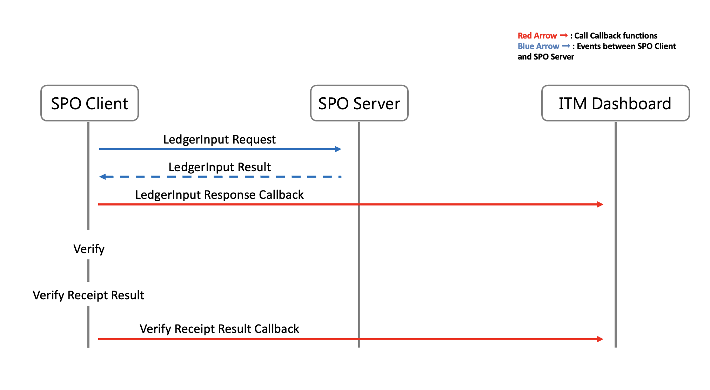

## Callback 串接實作說明

### 關於 Callback 實作說明文件

- Callback 的功能為將 BNS Client 與 BNS Server 之間發生的事件傳送至 [Blockchain Notary Service](https://bns.itrustmachines.com/) 顯示或是自己的系統中。在上一份文件中，你已經了解如何設計 CMD。在這份文件中，我們將引導您了解 Callback 如何將事件傳送至 [Blockchain Notary Service](https://bns.itrustmachines.com/) 以及實作 Callback 將事件傳送至自己的系統。

- 我們總共定義 8 個事件可以 Callback
  

  1. `register_callback` : BNS Client 初始化時，會向 BNS Server 進行註冊，開發者可實作此函式將 `registerRequest` 和 `registerResult` Callback
  
  2. `create_ledger_input_by_cmd_callback` :
     - BNS Client 初始化成功，會將 CMD 等資訊放入 `ledgerInputRequst` 並進行 **ledgerInput** 開發者可實作此函式將 `ledgerInputRequest` Callback。
     - 若開發者使用 CMD 文件中的檔案存證功能，BNS Client 會將 CMD 等資訊放入 `ledgerInputRequst` 並進行 **binaryLedgerInput** 開發者可實作此函式將 `ledgerInputRequest` Callback
  
  3. `ledger_input_response_callback` : BNS Client ledgerInput 後會收到 BNS Server 回傳的 `ledgerInputResult`，開發者可實作此函式將 `ledgerInputResult` Callback
  
  4. `binary_ledger_input_response_callback` : 若開發者使用 CMD 文件中的檔案存證功能，BNS Client 會進行 binaryLedgerInput，並會收到 BNS Server 回傳的 `binaryLedgerInputResult`，開發者可實作此函式將 `binaryLedgerInputResult` Callback
  
  5. `receipt_event_callback` : 將 `ledgerInputResult` / `binaryLedgerInputResult` 中的 `receipt` Callback
  
  6. `done_clearance_order_event_callback` : 將 `ledgerInputResult` / `binaryLedgerInputResult` 中的 `doneClearanceOrder` Callback
  
  7. `merkle_proof_callback` : BNS Client 驗證回條前，會先向 BNS Server 拿取 MerkleProof 作為驗證依據，開發者可實作使函式將 `merkleProof` Callback
  
  8. `verify_receipt_result_callback` : BNS Client 取得 MerkleProof 後會開始驗證回條，並將驗證結果放入 `verifyReceiptResult`，開發者可實作此函式將 `verifyReceiptResult` Callback

- Callback 此文件分成兩部分
  - **[入門](#入門)** : 使用 BNS 作為範例，說明 `ledger_input_response_callback` 和 `verify_receipt_result_callback` 如何將事件 Callback 至 [Blockchain Notary Service](https://bns.itrustmachines.com/) 。

  - **[進階](#進階)** : 此進階文件將引導開發者了解 8 個事件的運作流程以及實作時每個 Callback 的注意事項。

- Callback 實作注意事項
  - 若開發者想直接使用 BNS，僅需了解入門文件中的兩個 Callback 運作流程且不需更改任何程式
  - **若開發者想使用其他 Callback 請閱讀進階文件並實作 Callback 將事件傳送至自己的系統，因 BNS API 僅提供 `ledger_input_response_callback` 和 `verify_receipt_result_callback` 串接。**
  - **若開發者想使用 CMD 檔案存證驗證功能，則需執行 [spo_client_binary_example](../example/bns-client-binary-example) 中的程式必將程式實作在此資料夾中**

- callback 相關檔案

  - [callback.h](../example/bns-client-example/callback.h)
  - [callback.c](../example/bns-client-example/callback.c)

### 入門

- 使用 BNS 作為範例，說明 `ledger_input_response_callback` 和 `verify_receipt_result_callback` 兩個最基本的 Callback

- 開發者閱讀 Callback 說明時，可參考說明下方的程式以方便理解。

- 關係圖
  

#### ledger_input_response_callback 說明

- 用戶在 [Blockchain Notary Service](https://bns.itrustmachines.com/) 中看到的存證資料資訊便是透過此 Callback 將資料傳送至 BNS 上顯示。
  

- BNS Client 將 CMD 傳送至 BNS Server 存證上鏈這個動作我們稱為 `ledgerInput`。每次 `ledgerInput` 後 BNS Server 會回傳 `ledgerInputResult` 給 BNS Client。`ledgerInputResult` 中包含回條、已完成清算序號、狀態 ... 等資訊。
  
- 為確保每次 Callback 的 `clearanceOrder` 和 `indexValue` 正確性以及方便用戶日後查詢存證資料，所以我們會從回條中複製 `clearanceOrder` 和 `indexValue` 至 `receiptLocator` Callback 至 BNS

- API 資訊可參考 [ITM Blockchain Notary Service 事前準備與API](https://hackmd.io/E6zkoH__Qmm6GDcbQ09vyg)

- [callback.c](../example/bns-client-example/callback.c)
  
  ```C
  void ledger_input_response_callback(
    const receipt_locator_t *receiptLocator,
    const char *cmdJson, 
    const ledger_input_result_t *ledgerInputResult){
      ...
      ...
      // 將回條中的 clearanceOrder 和 indexValue 儲存至 receiptLocator
      _receiptLocator.clearanceOrder = ledgerInputResult->receipt->clearanceOrder;
      spo_strdup(&_receiptLocator.indexValue, ledgerInputResult->receipt->indexValue);

      send_ledger_input_result_to_dashboard(&_receiptLocator, ledgerInputResult, cmdJson, &retryCount);
      ...
      ...
    }
  ```

#### verify_receipt_result_callback 說明

- 用戶在 BNS 中看到的驗證結果資訊便是透過此 Callback 將驗證資料傳送至 BNS 上顯示。

- BNS Client 驗證回條後，會將驗證結果儲存至 `verifyReciptResult` 並呼叫 [callback.c](../example/bns-client-example/callback.c) 中的 `verify_receipt_result_callback` 函式將 `verifyReceiptResult` Callback 到 BNS 上顯示

- 為了更新存證資料的驗證狀態，所以在 Callback 時我們會將 `verifyReceiptResult` 中的 `clearanceOrder` 和 `indexValue` Callback 至 BNS

- API 資訊可參考 [ITM Blockchain Notary Service 事前準備與API](https://hackmd.io/E6zkoH__Qmm6GDcbQ09vyg)

- [callback.c](../example/bns-client-example/callback.c)
  
  ```C
  void verify_receipt_result_callback(
    _UNUSED const receipt_t *receipt, 
    _UNUSED const merkle_proof_t *merkleProof,
    const verify_receipt_result_t *verifyReceiptResult) {
     
      LOG_DEBUG("get_verify_receipt_result() begin");
      size_t retryCount = 5;

      send_verify_receipt_result_to_dashboard(verifyReceiptResult, &retryCount);
      LOG_DEBUG("get_verify_receipt_result() end");
    }
  ```

- 您現在已經了解兩個最基本的 Callback 服務。若您要使用其他 Callback 服務則請接續閱讀進階文件了解其他 Callback 功能並整合至自己的系統。BNS API 無提供 API 讓其他 Callback 與 BNS 進行串接
- 若您想直接使用 BNS，則不需更改任何程式，可前往下一章閱讀 [reciptDao 功能說明](./receiptDao_zh.md)，了解 BNS Client 是如何存取回條及尋找待驗證的回條。

### 進階

- 此進階文件會介紹 7 種事件的Callback 因此篇幅較長，建議開發者閱讀各事件說明時可一併參考說明下方的程式以方便理解。
- 實作時，務必將各 Callback 函式傳入變數前的 `_UNUSED` 刪除
- 關係圖
  

#### register_callback 說明

##### BNS Client 初始化時，會向 BNS Server 進行註冊，若您想將註冊資訊 Callback 至自己的系統，可閱讀下方說明及程式

- BNS Client 初始化時，[spo_client.c](../src/bns-client/spo_client.c) 會呼叫 [register.c](../src/bns-client/register/register.c) 中的 `spo_post_register` 函式建立 `registerRequest` 並向 BNS Server 請求註冊

- BNS Server 收到請求註冊後會將註冊結果回傳給 BNS Client，BNS Client 會透過 `spo_post_register` 中的 `check_and_parse_register_response` 函式將註冊結果資訊放入 `registerResult`

- `registerRequest` 和 `registerResult` 為 struct 資料型別，內容可參考 [spo_types.h](../src/bns-client/core/spo_types.h)

- 開發者可在 [callback.c](../example/bns-client-example/callback.c) 的 `register_callback` 撰寫程式將 `registerRequest` 和 `registerResult` Callback 至自己的系統

- [spo_client.c](../src/bns-client/spo_client.c)
  
  ```C
  spo_exit_code_t spo_client_init(
    spo_client_t *const spoClient, const char *const privateKey,
    const char *const indexValueKey, const char *const serverUrl,
    const char *const nodeUrl, const receipt_dao_t *const receiptDao,
    const http_client_t *const httpClient,
    const spo_client_callback_t *const spoClientCallback) {
      ...
      ...
      register_result_t registerResult = 0;
      if ((exitCode = spo_post_register(spoClient, &registerResult)) != SPO_OK) {
        goto spo_client_init_fail;
      }
      ...
      ...
    }
  ```

- [register.c](../src/bns-client/register/register.c)
  
  ```C
  spo_exit_code_t spo_post_register(
    const spo_client_t *const spoClient,
    register_result_t *const registerResult) {
      ...
      ...
      if ((exitCode = build_register_request_with_sig(spoClient, &registerRequest, &reqJson)) != SPO_OK) {
        goto spo_post_register_fail;
      }
      
      url = build_post_register_url(spoClient->config.serverUrl);
      
      if (!url) {
        exitCode = SPO_POST_REGISTER_URL_NULL_ERROR;
        goto spo_post_register_fail;
      }

      res = spoClient->httpClient.spo_post(url, reqJson);
      if (!res) {
        exitCode = SPO_POST_REGISTER_RESPONSE_NULL_ERROR;
        goto spo_post_register_fail;
      }
      SPO_FREE(reqJson);
      SPO_FREE(url);

      exitCode = check_and_parse_register_response(res, registerResult);
      
      if (exitCode != SPO_OK) {
        goto spo_post_register_fail;
      }
      
      SPO_FREE(res);
      
      if (spoClient->spoClientCallback.register_result) {
        spoClient->spoClientCallback.register_result(&registerRequest, *registerResult);
      }
      ...
      ...
    }
  ```

- [callback.c](../example/bns-client-example/callback.c)

  ```C
  void register_result_callback(
    _UNUSED const register_request_t *registerRequest,
    _UNUSED register_result_t registerResult) {
      
      LOG_DEBUG("register_result() begin");
      LOG_DEBUG("register_result() end");
    }
  ```

#### create_ledger_input_by_cmd_callback 說明

##### BNS Client 初始化成功，會將 CMD 等資訊放入 ledgerInputRequst 並進行 ledgerInput / binaryLedgerInput，若您想將 ledgerInputRequst 的資訊 Callback 至自己的系統，可閱讀下方說明及程式

- BNS Client 初始化成功後，[spo_client.c](../src/bns-client/spo_client.c) 的 `spo_client_ledger_input` 函式會呼叫 [ledger_input.c](../src/bns-client/input/ledger_input.c) 中的 `spo_post_ledger_input` 函式進行 `ledgerInput`

- **若開發者使用 CMD 文件中的檔案存證功能，[spo_client.c](../src/bns-client/spo_client.c) 的 `spo_client_binary_ledger_input` 函式會呼叫 [binary_ledger_input.c](../src/bns-client/input/binary_ledger_input.c) 中的 `spo_post_binary_ledger_input` 函式進行 `binaryLedgerInput`**

- `spo_post_ledger_input` / `spo_post_binary_ledger_input` 函式在進行 `ledgerInput` / `binaryLedgerInput` 前會呼叫 [ledger_input_request.c](../src/bns-client/input/ledger_input_request.c) 中的 `build_ledger_input_request_json` 函式將 `CMD`, `indexValue` ... 等資訊放入 `ledgerInputRequest`，並透過 `ledger_input_request_sign` 函式將 `ledgerInputRequest` 進行電子簽章

- 電子簽章後，`spo_post_ledger_input` / `spo_post_binary_ledger_input` 函式會將 `ledgerInputRequest` 傳送至 BNS Server 進行存證

- `ledgerInputRequest` 為 struct 資料型別，內容可參考 [spo_types.h](../src/bns-client/core/spo_types.h)

- 開發者可在 [callback.c](../example/bns-client-example/callback.c) 的 `create_ledger_input_by_cmd_callback` 撰寫程式將 `ledgerInputRequest` 的資訊 Callback 至自己的系統

- **建議實作時可將 `ledgerInputRequest` 中的 `clearanceOrder` 和 `indexValue` 儲存至 `receiptLocator`** 方便日後搜尋資料

- [spo_client.c](../src/bns-client/spo_client.c)
  
  ```C
  spo_exit_code_t spo_client_ledger_input(
    const spo_client_t *const spoClient,
    const char *const cmdJson) {                          
      ...
      ...
      exitCode = spo_post_ledger_input(spoClient, cmdJson, &receiptLocator, &ledgerInputResult);
      ...
      ...
    }
  ```

- [ledger_input.c](../src/bns-client/input/ledger_input.c)
  
  ```C
  spo_exit_code_t spo_post_ledger_input(
    const spo_client_t *const spoClient, 
    const char *const cmdJson,
    const receipt_locator_t *const receiptLocator,
    ledger_input_result_t *const ledgerInputResult) {
      ...
      ...
      if ((exitCode = build_ledger_input_request_json( spoClient, cmdJson, receiptLocator, &reqJson)) != SPO_OK) {
        goto spo_post_ledger_input_fail;
      }

      url = build_post_ledger_input_url(spoClient->config.serverUrl);
      res = spoClient->httpClient.spo_post(url, reqJson);
      ...
      ...
    }
  ```

- [ledger_input_request.c](../src/bns-client/input/ledger_input_request.c)
  
  ```C
  spo_exit_code_t build_ledger_input_request_json(
    const spo_client_t *spoClient, const char *cmdJson,
    const receipt_locator_t *receiptLocator, char **reqJson) {
      ...
      ...
      if ((exitCode = build_ledger_input_request(spoClient, cmdJson, receiptLocator, &ledgerInputRequest)) != SPO_OK) {
        goto build_ledger_input_request_json_fail;
      }

      if ((exitCode = ledger_input_request_sign( &ledgerInputRequest, spoClient->config.privateKey)) != SPO_OK) {
        goto build_ledger_input_request_json_fail;
      }

      if (spoClient->spoClientCallback.create_ledger_input_by_cmd) { 
        spoClient->spoClientCallback.create_ledger_input_by_cmd(receiptLocator, &ledgerInputRequest);
      }
      ...
      ...
    }
  ```

- [callback.c](../example/bns-client-example/callback.c)

  ```C
  void create_ledger_input_by_cmd_callback(
    _UNUSED const receipt_locator_t *receiptLocator,
    _UNUSED const ledger_input_request_t *ledgerInputRequest) {
      
      LOG_DEBUG("create_ledger_input_by_cmd() begin");
      LOG_DEBUG("create_ledger_input_by_cmd() end");
    }
  ```

#### ledger_input_response_callback 說明

##### BNS Client ledgerInput 後會收到 BNS Server 回傳的 ledgerInputResult，若您想將 ledgerInputResult 的資訊 Callback 至自己的系統，可閱讀下方說明及程式

- BNS Client 將 `ledgerInputRequest` 傳送至 BNS Server 進行存證後，BNS Server 會將存證結果回傳給 BNS Client

- BNS Client 會透過 [ledger_input.c](../src/bns-client/input/ledger_input.c) 中的 `check_and_parse_ledger_input_response` 函式將存證結果放入 `ledgerInputResult`

- `ledgerInputResult` 為 struct 資料型別，內容可參考 [bns_types.h](../src/bns-client/core/bns_types.h)

- 開發者可在 [callback.c](../example/bns-client-example/callback.c) 的 `ledger_input_response_callback` 撰寫程式將 `ledgerInputResult` 的資訊 Callback 至自己的系統

- **建議實作時可將 `ledgerInputResult` 中的 `clearanceOrder` 和 `indexValue` 儲存至 `receiptLocator`**，方便日後搜尋資料

- 除了將 `ledgerInputResult` Callback 外，**開發者可實作 `receitp_event_callback` 和  `done_clearance_order_event_callback` 分別將 `ledgerInputResult` 中的 `receipt` 和 `doneClearanceOrder` Callback。詳細說明請繼續閱讀下方文件**

- [ledger_input.c](../src/bns-client/input/ledger_input.c)
  
  ```C
  bns_exit_code_t bns_post_ledger_input(
    const bns_client_t *const bnsClient, 
    const char *const cmdJson,
    const receipt_locator_t *const receiptLocator,
    ledger_input_result_t *const ledgerInputResult) {
      ...
      ...
      if ((exitCode = check_and_parse_ledger_input_response(res, ledgerInputResult)) != SPO_OK) {
        goto bns_post_ledger_input_fail;
      }
      ...
      ...
    }
  ```

- [bns_client.c](../src/bns-client/bns_client.c)
  
  ```C
  bns_exit_code_t bns_client_ledger_input(
    const bns_client_t *const bnsClient,
    const char *const cmdJson) {
      ...
      ...
      if (bnsClient->bnsClientCallback.obtain_ledger_input_response) {
        bnsClient->bnsClientCallback.obtain_ledger_input_response(&receiptLocator, cmdJson, &ledgerInputResult);
      }
      ...
      ...
    }
  ```

- [callback.c](../example/bns-client-example/callback.c)
  
  ```C
  void ledger_input_response_callback(
    const receipt_locator_t *receiptLocator,
    const char *cmdJson, 
    const ledger_input_result_t *ledgerInputResult){
      ...
      ...
      send_ledger_input_result_to_dashboard(&_receiptLocator, ledgerInputResult, cmdJson, &retryCount);
      ...
      ...
    }
  ```

#### receipt_event_callback 說明

##### 若您想將 ledgerInputResult / binaryLedgerInputResult 中的回條 Callback 至自己的系統，可閱讀下方說明及程式

- 開發者可在 [callback.c](../example/bns-client-example/callback.c) 的 `receipt_event_callback` 撰寫程式將 `receipt` 的資訊 Callback 至自己的系統

- `receipt` 為 struct 資料型別，內容可參考 [bns_types.h](../src/bns-client/core/bns_types.h)

- **建議實作時建議將回條 `receipt` 中的 `indexValue` 和 `clearanceOrder` Callback 至自己系統，以方便搜尋回條資料**

- [bns_client.c](../src/bns-client/bns_client.c)
  
  ```C
  bns_exit_code_t bns_client_ledger_input(
    const bns_client_t *const bnsClient,
    const char *const cmdJson) {
      ...
      ...
      if (bnsClient->bnsClientCallback.obtain_receipt_event) {
        bnsClient->bnsClientCallback.obtain_receipt_event(ledgerInputResult.receipt);
      }
      ...
      ...
    }
  ```

- [callback.c](../example/bns-client-example/callback.c)

  ```C
  void receipt_event_callback(
    _UNUSED const receipt_t *receipt) {
      
      LOG_DEBUG("obtain_receipt() begin");
      LOG_DEBUG("obtain_receipt() end");
    }
  ```

#### done_clearance_order_event_callback 說明

##### 若您想將 ledgerInputResult / binaryLedgerInputResult 中的 doneClearanceOrder Callback 至自己的系統，可閱讀下方說明及程式

- 開發者可在 [callback.c](../example/bns-client-example/callback.c) 的 `done_clearance_order_event_callback` 撰寫程式將 `doneClearanceOrder` 的資訊 Callback 至自己的系統

- `doneClearanceOrder` 為 struct 資料型別，內容可參考 [bns_types.h](../src/bns-client/core/bns_types.h)

- [bns_client.c](../src/bns-client/bns_client.c)
  
  ```C
  bns_exit_code_t bns_client_ledger_input(
    const bns_client_t *const bnsClient,
    const char *const cmdJson) {
      ...
      ...
      if (bnsClient->bnsClientCallback.obtain_done_clearance_order_event) {
        bnsClient->bnsClientCallback.obtain_done_clearance_order_event(ledgerInputResult.doneClearanceOrder);
      }
      ...
      ...
    }
  ```

- [callback.c](../example/bns-client-example/callback.c)
  
  ```C
  void done_clearance_order_event_callback(
    _UNUSED clearance_order_t doneCO) {
      LOG_DEBUG("obtain_done_clearance_order() begin");
      LOG_DEBUG("obtain_done_clearance_order() end");
    }
  ```

#### merkle_proof_callback 說明

##### BNS Client 驗證回條前，會先向 BNS Server 拿取 MerkleProof 作為驗證依據，若您想將 MerkleProof Callback 至自己的系統，可閱讀下方說明及程式

- 當 BNS Client 要驗證回條時，BNS Client 會先透過 `doneClearanceOrder` 尋找待驗證回條，並在驗證前先向 BNS Server 取得回條雜湊值所在葉節點的 Merkle Proof，再呼叫 [verify.c](../src/bns-client/verify/verify.c) 中的 `verify` 函式開始驗證回條。

- [verify.c](../src/bns-client/verify/verify.c) 驗證回條前，會先呼叫 [merkle_proof.c](../src/bns-client/verify/merkle_proof.c) 中的 `bns_get_merkle_proof` 函式向 BNS Server 取得 Merkle Proof 並透過 `check_and_parse_merkle_proof_response` 函式將 BNS Server 回傳的資訊儲存至 `merkleProof`

- 開發者可在 [callback.c](../example/bns-client-example/callback.c) 的 `merkle_proof_callback` 撰寫程式將 `merkleProof` 的資訊 Callback 至自己的系統

- `merkleProof` 為 struct 資料型別，內容可參考 [bns_types.h](../src/bns-client/core/bns_types.h)

- [bns_client.c](../src/bns-client/bns_client.c)
  
  ```C
  bns_exit_code_t bns_client_verify_by_done_co(
    const bns_client_t *const bnsClient, 
    const size_t verifyCount,
    const clearance_order_t doneCO) {
      ...
      ...
      bnsClient->receiptDao.findPageByClearanceOrderEqualOrLessThan(doneCO, 0, count, receipt, &receiptCount);
      ...
      exitCode = verify(bnsClient, &receipt[i], &merkleProof, &verifyReceiptResult);
      ...
      ...
    }
  ```

- [verify.c](../src/bns-client/verify/verify.c)
  
  ```C
  bns_exit_code_t verify(
    const bns_client_t *const bnsClient,
    const receipt_t *const receipt,
    merkle_proof_t *const merkleProof,
    verify_receipt_result_t *const verifyReceiptResult) {
      ...
      ...
      exitCode = bns_get_merkle_proof(bnsClient, &receiptLocator, merkleProof);
      
      if (exitCode != BNS_OK) {
        goto verify_fail;
      }
      ...
      ...
    }
  ```

- [merkle_proof.c](../src/bns-client/verify/merkle_proof.c)
  
  ```C
  bns_exit_code_t bns_get_merkle_proof(
    const bns_client_t *const bnsClient,
    const receipt_locator_t *const receiptLocator,
    merkle_proof_t *const merkleProof) {
      ...
      ...
      url = build_post_merkle_proof_url(bnsClient->config.serverUrl, receiptLocator);
      res = bnsoClient->httpClient.bns_get(url);
      exitCode = check_and_parse_merkle_proof_response(res, merkleProof);
      if (exitCode != BNS_OK) {
        goto bns_get_merkle_proof_fail;
      }
      
      BNS_FREE(res);
      
      if (bnsClient->bnsClientCallback.obtain_merkle_proof) {
        bnsClient->bnsClientCallback.obtain_merkle_proof(receiptLocator, merkleProof);
      }
      ...
      ...
    }
  ```

- [callback.c](../example/bns-client-example/callback.c)

  ```C
  void merkle_proof_callback(
    _UNUSED const receipt_locator_t *receiptLocator,
    _UNUSED const merkle_proof_t *merkleProof) {
      LOG_DEBUG("obtain_merkle_proof() begin");
      LOG_DEBUG("obtain_merkle_proof() end");
    }
  ```

#### verify_receipt_result_callback 說明

##### BNS Client 取得 MerkleProof 後會開始驗證回條，並將驗證結果放入 verifyReceiptResult，若您想將 verifyReceiptResult Callback 至自己的系統，可閱讀下方說明及程式

- BNS Client 取得 `merkleProof` 後會開始進行驗證，[verify.c](../src/bns-client/verify/verify.c) 會依序呼叫 `verify_receipt_signature`, `verify_merkle_proof_signature`, `verify_clearance_order`, `verify_pb_pair`, `verify_merkle_proof_slice`, `verify_root_hash` 函式進行驗證，並將驗證結果儲存至 `verifyReceiptResult`

- 開發者可在 [callback.c](../example/bns-client-example/callback.c) 的 `verify_receipt_result_callback` 撰寫程式將 `verifyReceiptResult` 的資訊 Callback 至自己的系統

- 若開發者使用 CMD 檔案存證功能則需在 [callback.c](../example/bns-client-binary-example/callback.c) 的 `verify_receipt_result_callback` 撰寫程式將 `verifyReceiptResult` 的資訊 Callback 至自己的系統

- `verifyReceiptResult` 為 struct 資料型別，內容可參考 [bns_types.h](../src/bns-client/core/bns_types.h)

- **建議實作將 `verifyReceiptResult` 中的 `indexValue` 和 `clearanceOrder` Callback，才能更新驗證資料**

- [verify.c](../src/bns-client/verify/verify.c)
  
  ```C
  bns_exit_code_t verify(
    const bns_client_t *const bnsClient,
    const receipt_t *const receipt,
    merkle_proof_t *const merkleProof,
    verify_receipt_result_t *const verifyReceiptResult){
      ...
      ...
      verifyReceiptResult->pass = true;
      bns_strdup(&verifyReceiptResult->status, BNS_STATUS_OK);
      bns_strdup(&verifyReceiptResult->description, BNS_STATUS_OK);
      ...
      ...
    }
  ```

- [bns_client.c](../src/bns-client/bns_client.c)

  ```C
  bns_exit_code_t bns_client_verify_by_done_co(
    const bns_client_t *const bnsClient, 
    const size_t verifyCount,
    const clearance_order_t doneCO){
      ...
      ...
      if (bnsClient->bnsClientCallback.get_verify_receipt_result) {
        bnsClient->bnsClientCallback.get_verify_receipt_result(&receipt[i], &merkleProof, &verifyReceiptResult);
      }
      ...
      ...
    }
  ```

- [callback.c](../example/bns-client-example/callback.c)
  
  ```C
  void verify_receipt_result_callback(
    _UNUSED const receipt_t *receipt, 
    _UNUSED const merkle_proof_t *merkleProof,
    const verify_receipt_result_t *verifyReceiptResult) {
      
      LOG_DEBUG("get_verify_receipt_result() begin");
      size_t retryCount = 5;
      
      // 將資料驗證結果 Callback 至 BNS 顯示
      send_verify_receipt_result_to_dashboard(verifyReceiptResult, &retryCount);
      LOG_DEBUG("get_verify_receipt_result() end");
    }
  ```

您現在已經了解 BNS Client 和 BNS Server 溝通時會發生的事件以及 Callback 所有功能。接下來我們將引導您了解 BNS Client 如何使用 receiptDao 對回條進行存取並找尋待驗證的回條，

----

- [下一頁 : ReceiptDao 功能說明](./receiptDao_zh.md)
- [上一頁 : CMD 設計說明](./cmd_zh.md)
