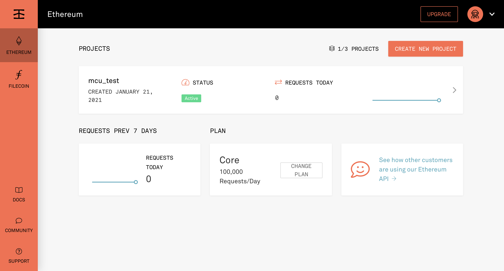
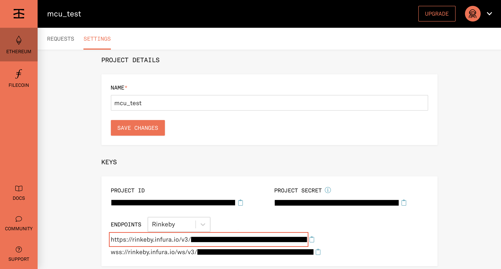

# Infura Tutorial

1. register an [infura account](https://infura.io/register)

2. Login to [Infura](https://infura.io/login)

3. Click ETHEREUM in the left side bar
   

4. Click CREATE NEW PROJECT
   

5. Enter project name，and click CREATE
   

6. Choose Rinkeby in ENDPOINTS MENU，and copy the URL and paste to the `nodeURL` columns which is in the configuration file[config.h](../example/bns-client-example/config.h)
   
