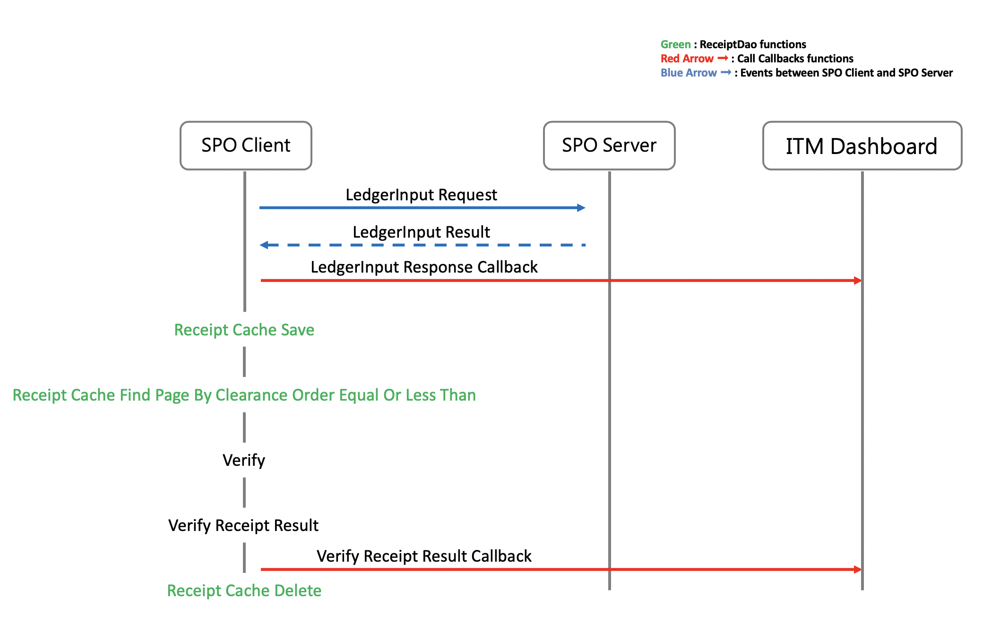

## ReceiptDao 功能說明

### 關於 ReceiptDao 功能說明文件

- ReceiptDao (Receipt Data Access Object) 的功能為存取回條並找出待驗證的回條，開發者可實作 ReceiptDao 將回條儲存在資料庫、雲端 ... 等其他服務中。在上一份文件中，您已經了解 Callback 的功能以及實作方式。在此份文件中，我們使用記憶體作為回條儲存地點引導您了解 BNS Client 如何透過 receiptDao 存取回條並找出待驗證的回條進行驗證

- 我們在 receipt_dao_t 中定義三個函式，分別為:
  
  - `receipt_cache_save` : 儲存 `ledgerInputResult` 中的 `receipt`
  - `receipt_cache_findPageByClearanceOrderEqualOrLessThan` : 利用 `clearanceOrder` 找出尚未驗證的回條進行驗證
  - `receipt_cache_delete` : 刪除驗證過的回條

  我們會在下方說明這三個函式的功能以及實作注意事項

### `receipt_dao_t` 相關檔案

- [receipt_dao.h](../example/bns-client-example/receipt_dao.h)
- [receipt_dao.c](../example/bns-client-example/receipt_dao.c)

### `receipt_dao_t` 各函式說明

- 關係圖
  

#### receipt_cache_save 說明

- BNS Client 會將 `ledgerInputResult` 中的 receipt 儲存起來，作為BNS Client 驗證回條時使用。

- 開發者實作時，請記得儲存回條，否則 BNS Client 無法驗證回條。

- 一筆回條大小約 0.5 KB (回條大小會隨著存證內容 `CMD` 以及資料上鏈索引值 `indexValue` 改變)，開發者可視設備硬體效能以及記憶體容量更改回條儲存筆數，此範例為儲存 1000 筆回條

- 若開發者想要更改回條的筆數，可更改 [receipt_dao.h](../example/bns-client-example/receipt_dao.h) 中 `RECEIPT_CACHE_SIZE` 的數量

- [ledgerInput.c](../src/bns-client/input/ledger_input.c)
  
  ```C
  bns_exit_code_t bns_post_ledger_input(
    const bns_client_t *const bnsClient, 
    const char *const cmdJson,
    const receipt_locator_t *const receiptLocator,
    ledger_input_result_t *const ledgerInputResult) {
      ...
      ...
      bnsClient->receiptDao.save(ledgerInputResult->receipt);
      ...
      ...
    }
  ```

- [receipt_dao.c](../example/bns-client-example/receipt_dao.c)

  ```C
  static receipt_t *receiptPtr[RECEIPT_CACHE_SIZE] = {0};

  void receipt_cache_save(const receipt_t *receipt){
    
    LOG_DEBUG("receipt_cache_save() begin");

    for (int i = 0; i < RECEIPT_CACHE_SIZE; i++) {
      
      if (!receiptPtr[i]) {
        receipt_t *_receipt = (receipt_t *)malloc(sizeof(receipt_t));
        ...
        ...
        receiptPtr[i] = _receipt;
        ...
        LOG_DEBUG("receipt_cache_save() end, index=%d", i);
        return;
      }
    }
  }
  ```

- [receipt_dao.h](../example/bns-client-example/receipt_dao.h)
  
  ```C
  #define RECEIPT_CACHE_SIZE 1000
  ```

#### receipt_cache_findPageByClearanceOrderEqualOrLessThan 說明

- BNS Server 會對 BNS Client 的 `ledgerInput` 進行清算上鏈。BNS Client 可以利用儲存下來的回條對 BNS Server 的清算進行驗證。
- BNS Client 會透過 `receipt_cache_findPageByClearanceOrderEqualOrLessThan` 找尋待驗證的回條，其中 `doneClearanceOrder, doneCO` 為 BNS Server 上已完成清算的序號，若儲存的回條中的 `clearanceOrder` 小於現在 BNS Server 的 `doneCO`，則必須拿出來做驗證

- [bns_client.c](../src/bns-client/bns_client.c)
  
  ```C

  bns_exit_code_t bns_client_verify_by_done_co(
    const bns_client_t *const bnsClient, const size_t verifyCount,
    const clearance_order_t doneCO) {
      ...
      ...
      receipt = (receipt_t *)malloc(sizeof(receipt_t) * count);
      memset(receipt, 0, sizeof(receipt_t) * count);
      bnsClient->receiptDao.findPageByClearanceOrderEqualOrLessThan(doneCO, 0, count, receipt, &receiptCount);
      ...
      ...
    }
  ```

- [receipt_dao.c](../example/bns-client-example/receipt_dao.c)

  ```C
  void receipt_cache_findPageByClearanceOrderEqualOrLessThan (
    const clearance_order_t clearanceOrder,
    const size_t page,
    const size_t pageSize,
    receipt_t *outputReceipt,
    size_t *outputSize){
      LOG_DEBUG("receipt_cache_findPageByClearanceOrderEqualOrLessThan() begin");
      ...
      ...
      for (i = 0; i < RECEIPT_CACHE_SIZE; i++) {
        ...
        ...
        if (receiptPtr[i]->clearanceOrder <= clearanceOrder) {
          ...
        }
        ...
        ...
      }
      ...
      LOG_DEBUG("receipt_cache_findPageByClearanceOrderEqualOrLessThan() end, ""outputSize=%ld",*outputSize);
    }
  ```

#### receipt_cache_delete 說明

- 為了節省 BNS Client 記憶體使用量，當回條驗證完之後，BNS Client 會將回條刪除

- [bns_client.c](../src/bns-client/bns_client.c)
  
  ```C
  bns_exit_code_t bns_client_verify_by_done_co(
    const bns_client_t *const bnsClient, 
    const size_t verifyCount,
    const clearance_order_t doneCO) {
      ...
      ...
      bnsClient->receiptDao.delete(&receipt[i]);
      ...
      ...
  }
  ```

- [receipt_dao.c](../example/bns-client-example/receipt_dao.c)

  ```C
  void receipt_cache_delete(const receipt_t *receipt){
    LOG_DEBUG("receipt_cache_delete() begin");
    ...
    ...
    LOG_DEBUG("receipt_cache_delete() end");
  }
  ```

您現在已經了解 BNS Client receiptDao 的功能。接下來我們將引導您了解並調整 BNS Client 的其他設定

----

- [下一頁 : BNS Client 其他設定](./other_setting_zh.md)
- [上一頁 : Callback 串接實作教學](./callback_zh.md)
