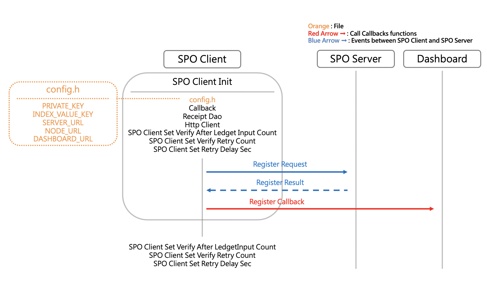
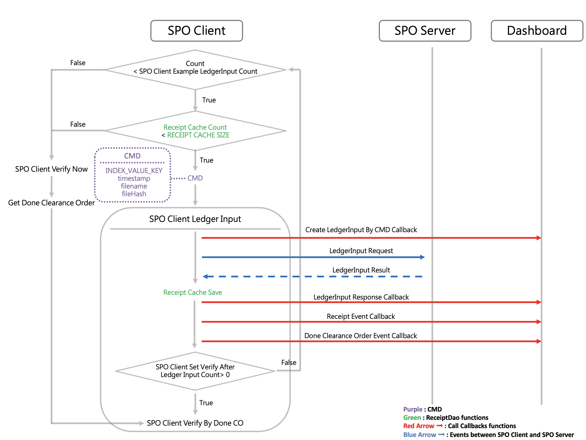
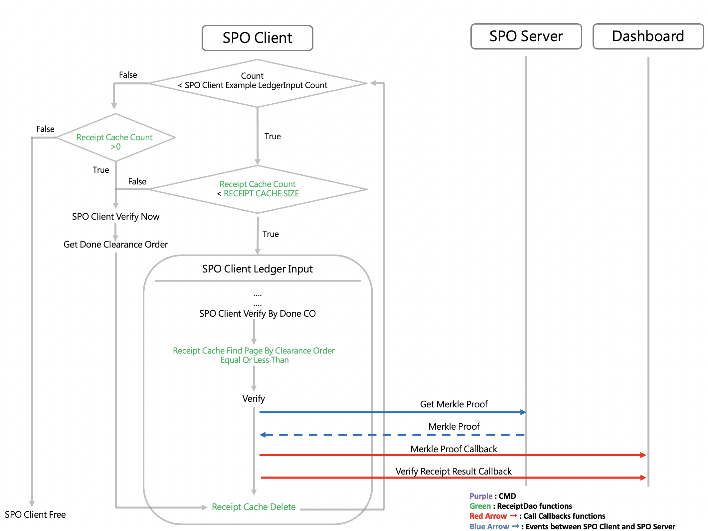

## 主程式說明

### 關於主程式說明文件

若您想對我們 SDK 的運作流程有更清楚的了解或是想更改 SDK 其他程式，我們建議您可以閱讀此份文件。在這份文件中，我們將依照 BNS Client 主程式的運作流程整合前面的教學內容及設定。閱讀此文件前，我們希望您已經了解所有 SDK 的設定、Callback、ReceiptDao 的實作方式。

主程式檔案 : [bns_client_example.c](../example/bns-client-example/bns_client_example.c)

### 設定 Callback 服務

- BNS Client 會將各 Callback 程式讀入以建立 Callback 服務，Callback 實作說明請參考 [Callback 串接實作說明](./callback_zh.md)
  
  ```C
  bns_client_callback_t bnsClientCallback = {
      .register_result = register_result_callback,
      .create_ledger_input_by_cmd = create_ledger_input_by_cmd_callback,
      .obtain_ledger_input_response = ledger_input_response_callback,
      .obtain_binary_ledger_input_response = binary_ledger_input_response_callback,
      .obtain_receipt_event = receipt_event_callback,
      .obtain_done_clearance_order_event = done_clearance_order_event_callback,
      .obtain_merkle_proof = merkle_proof_callback,
      .get_verify_receipt_result = verify_receipt_result_callback};
  ```

### 設定 ReceiptDao 功能

- BNS Client 會將各 receiptDao 程式讀入以建立 receiptDao 功能，receiptDao 詳細說明請參考[ReceiptDao 功能說明](./receiptDao_zh.md)
  
  ```C
  receipt_dao_t receiptDao = {
      .save = receipt_cache_save,
      .delete = receipt_cache_delete,
      .findPageByClearanceOrderEqualOrLessThan = receipt_cache_findPageByClearanceOrderEqualOrLessThan};
  ```

### 建立 HttpClient 服務

- BNS Client 會將 httpClient 程式讀入建立所有與網路相關的服務，開發者不需更改 httpClient 中的程式

  ```C
  http_client_t httpClient = {
      .spo_get = spo_get, 
      .spo_post = spo_post, 
      .eth_post = eth_post};
  ```

### 初始化 BNS Client

- 關係圖
  

- 為了與 BNS Server 建立上鏈存證與驗證服務，BNS Client 會呼叫此函式進行 config.h, receiptDao, httpClient, callback 的初始化，並向 BNS Server 註冊

- 若開發者有實作 `register_callback`，BNS Client 會在初始化時將 `registerRequest` 和 `registerResponse` Callback 至自己的系統
  
- `PRIVATE_KEY`、`INDEX_VALUE_KEY`、`SERVER_URL`、`NODE_URL` : [請見修改設定檔 config.h 說明](./quick_start_zh.md)

- `receiptDao` : BNS Client 中處理與回條有關的資料存取，[請參考 ReceiptDao 說明](./receiptDao_zh.md)

- `callback` : 將 BNS Client 與 BNS Server 發生的事件串接至其他服務，[請參考 Callback 說明](./callback_zh.md)

  ```C
  spo_client_t spoClient = {0};
  if ((spoExitCode = spo_client_init(
    &spoClient, PRIVATE_KEY, INDEX_VALUE_KEY, SERVER_URL, NODE_URL,
    &receiptDao, &httpClient, &spoClientCallback)) != SPO_OK) {
      goto spo_client_example_fail;
  }
  
  ```

- 初始化後，BNS Client 會將開發者對下方三個函式的設定值讀入並更新設定，設定詳細資訊，請參考 [BNS Client 其他設定說明](./other_setting_zh.md)

- `spo_client_set_verify_after_ledger_input_count` : 設定每次 ledgerInput 後驗證幾筆回條
- `spo_client_set_retry_count` : 設定最大 `ledgerInput` 重試次數
- `spo_client_set_retry_delay_sec` : 設定每次重試 `ledgerInput` 時的延遲秒數

  ```C
  if ((spoExitCode = spo_client_set_verify_after_ledger_input_count( &spoClient, 2)) != SPO_OK) {
    goto spo_client_example_fail;
  }

  if ((spoExitCode = spo_client_set_retry_count(&spoClient, 5)) != SPO_OK) {
    goto spo_client_example_fail;
  }

  if ((spoExitCode = spo_client_set_retry_delay_sec(&spoClient, 5)) != SPO_OK) {
    goto spo_client_example_fail;
  }
  ```

### 資料存證

- 關係圖
  

- BNS Client 初始化且成功註冊後，將 CMD 轉換成 JSON 資料型別並呼叫 [spo_client.c](../src/bns-client/spo_client.c) 中的 `spo_client_ledger_input` 進行資料存證，CMD 詳細資訊請參考 [CMD實作說明](./cmd_zh.md)

- `spo_client_ledger_input` 函式會將 `cmdJSON` 與其他資訊儲存至 `ledgerInputRequest` 並傳送到 BNS Server 然後將 BNS Server 回傳的 `ledgerInputResponse` 中的 `receipt` 透過 receiptDao 儲存至記憶體內。

- 若開發者有實作 `create_ledger_input_by_cmd_callback`、`ledger_input_response_callback`、`receipt_event_callback`、`done_clearance_order_event_callback`， BNS Client 會依序將各事件發生的資訊 Callback 至自己的系統

- 若 `spo_client_set_verify_after_ledger_input_count` 設定大於 0，會呼叫 [spo_client.c](../src/bns-client/spo_client.c) 中的 `spo_client_verify_by_done_co` 進行回條驗證

- 若 BNS Client 回條儲存筆數達到 `RECEIPT_CACHE_SIZE` 或是達到 `SPO_CLIENT_EXAMPLE_LEDGER_INPUT_COUNT` 數量 ，BNS Client 會呼叫 [spo_client.c](../src/bns-client/spo_client.c) 中的 `spo_client_verify_now` 驗證回條

### 資料驗證

- 關係圖
  

- `spo_client_verify_by_done_co` 驗證前會呼叫 receiptDao 的 `receipt_cache_findPageByClearanceOrderEqualOrLessThan` 找出小於等於 `doneClearanceOrder` 的回條進行驗證並向 BNS Server 拿取 `Merkle Proof` 再進行驗證，並在驗證完後將回條刪除。

- `spo_client_verify_now` 會呼叫 `spo_get_done_clearanceOrder` 向 BNS Server 拿取最新的 `doneClearanceOrder`， 再呼叫 `spo_client_verify_by_done_co` 進行驗證

- 若開發者有實作 `merkle_proof_callback`、`verify_receipt_result_callback`， BNS Client 會將各事件資訊 Callback 至自己的系統

  ```C
  size_t count = 0;

  while (count < SPO_CLIENT_EXAMPLE_LEDGER_INPUT_COUNT) {
    if (receipt_cache_count() < RECEIPT_CACHE_SIZE) {

      char cmdJson[CMD_LEN] = {0};
      char *timestamp = get_timestamp_string();

      sprintf(cmdJson, "{\"deviceId\":\"%s\",\"timestamp\":%s}", INDEX_VALUE_KEY, timestamp);
      SPO_FREE(timestamp);

      if ((spoExitCode = spo_client_ledger_input(&spoClient, cmdJson)) != SPO_OK) {
        goto spo_client_example_fail;
      }
      count++;
    } else {

      if ((spoExitCode = spo_client_verify_now(&spoClient, 5)) != SPO_OK) {
        goto spo_client_example_fail;
      }
      nanosleep((const struct timespec[]){{1L, 0L}}, NULL);
    }
  }
  while (receipt_cache_count() != 0) {
    if ((spoExitCode = spo_client_verify_now(&spoClient, 5)) != SPO_OK) {
      goto spo_client_example_fail;
    }
    LOG_INFO("spo_client_example() wait");
    nanosleep((const struct timespec[]){{1L, 0L}}, NULL);
  }
  ```

### 結束 BNS Client

- 當 BNS Client ledgerInput 達到 `SPO_CLIENT_EXAMPLE_LEDGER_INPUT_COUNT` 並將記憶體內的回條驗證完後。會呼叫 `spo_client_free` 釋放記憶體空間並離開程式

  ```C
  spo_client_free(&spoClient);
  ```

----
[首頁](../README_ZH.md)
